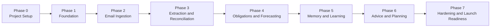

# Irene Implementation Plan

## 1. Purpose

This document translates the architecture defined in [technical-architecture.md](/Users/subho/Documents/Workspace/Projects/irene/docs/technical-architecture.md) into a concrete execution plan. It defines what needs to be built, in what order, why that order matters, and what "done" means for each phase.

This plan is for the MVP only.

## 2. MVP Outcome

At the end of this implementation plan, Irene should be able to:

- connect to a personal email account
- ingest and persist finance-relevant emails and attachments
- extract candidate financial information from those documents
- reconcile the extracted data into a canonical ledger of financial events
- identify recurring obligations such as subscriptions and EMIs
- identify repeatable income patterns
- project near-term cash flow and obligations
- maintain a review queue for ambiguous items
- learn from user corrections through persistent memory
- generate actionable finance insights and planning guidance

## 3. Implementation Principles

The build should follow these rules:

1. Build the canonical ledger first, not the AI layer first.
2. Make every workflow idempotent before making it fast.
3. Prefer deterministic logic before AI-assisted inference.
4. Ship thin vertical slices early so the system can be exercised end to end.
5. Preserve raw evidence and auditability from day one.
6. Treat user correction loops as a first-class product surface.
7. Do not block frontend requests on long-running background work.

## 4. Delivery Strategy

The MVP should be implemented in layered phases. Each phase should leave the system in a usable state and unlock the next phase. The phases are designed to reduce risk in this order:

1. establish infrastructure and source of truth
2. ingest real data safely
3. convert data into structured finance objects
4. derive recurring behavior and forecasts
5. add learning and personalization
6. layer insights and planning on top

## 5. Recommended Stack Decisions

For implementation, standardize on:

- `Next.js` for the frontend and internal API routes
- `Postgres` as the primary relational store
- `Redis + BullMQ` for workflow orchestration
- `Drizzle ORM` for schema and type-safe access
- `Zod` for API and job payload validation
- `Auth.js` for authentication
- `OpenTelemetry` and structured logs for observability
- managed object storage for attachments and large raw HTML payloads

This plan assumes those choices unless explicitly changed.

## 6. Workstreams

The implementation can be reasoned about as parallel workstreams, but they must converge around shared domain contracts.

### 6.1 Product Workstream

- page flows
- review queue behavior
- advice UX
- goal and forecast presentation

### 6.2 Platform Workstream

- app shell
- environment setup
- CI
- secrets and deployment
- observability

### 6.3 Data Workstream

- schema design
- migrations
- indexing
- seed data
- retention policies

### 6.4 Workflow Workstream

- queue setup
- workers
- job contracts
- retries
- idempotency

### 6.5 AI and Intelligence Workstream

- extraction contracts
- structured output parsing
- merchant normalization support
- classification context assembly
- advice phrasing

### 6.6 Finance Domain Workstream

- canonical event model
- recurring detection
- EMI modeling
- income stream modeling
- forecasting
- memory and auto-learning

## 7. Phase Map

## 8. Phase 0: Project Setup

### Goals

- establish repository conventions
- make local development reproducible
- define environment strategy

### Deliverables

- finalized package layout
- environment variable contract
- local dev setup instructions
- lint, typecheck, and test commands
- CI pipeline skeleton

### Tasks

- create app and package directories needed by the architecture
- standardize package naming and path aliases
- choose Drizzle as ORM and set migration flow
- add Redis, Postgres, and object storage config placeholders
- add shared config package for runtime validation
- define local, staging, and production env files and secret expectations

### Acceptance Criteria

- a new developer can install dependencies and start the web app locally
- CI can run lint and typecheck successfully
- environment validation fails fast if required configuration is missing

## 9. Phase 1: Foundation

### Goals

- create the core application skeleton
- establish the database and queueing primitives
- ship the first authenticated app shell

### Deliverables

- authenticated Next.js app shell
- worker app bootstrapped
- Postgres connection and schema tooling
- Redis and BullMQ bootstrapped
- observability baseline

### Tasks

- implement authentication and session handling
- create the core user and settings tables
- implement database client package and migration pipeline
- bootstrap BullMQ queues and worker runner
- define job registry and queue naming conventions
- add structured logging and request/job correlation ids
- implement a settings page scaffold

### Technical Notes

- no business workflows should exist yet
- the worker should be deployable even if it only runs health-check jobs
- queue operations must be instrumented from the beginning

### Acceptance Criteria

- user can sign in
- user record and settings record are created automatically
- web app and worker can both connect to Postgres and Redis
- queue dashboard or equivalent job visibility exists
- logs can trace a request or job through the system

## 10. Phase 2: Email Ingestion

### Goals

- connect an email provider
- reliably ingest raw finance-related email documents
- persist sync state and source evidence

### Deliverables

- email OAuth connection flow
- mailbox sync jobs
- raw document storage
- attachment metadata capture
- backfill and incremental sync support

### Tasks

- implement provider OAuth flow
- store encrypted access and refresh tokens
- define mailbox sync cursors and sync windows
- build initial backfill job
- build incremental sync job
- store raw emails in `raw_document`
- store attachments in object storage and `document_attachment`
- add dedupe by provider message id and message hash
- create basic integration settings UI

### Key Risks

- provider token expiry
- duplicate syncs
- inbox volume during backfill
- malformed HTML or huge email bodies

### Acceptance Criteria

- user can connect a mailbox
- system can backfill a defined recent window of messages
- repeated sync runs do not create duplicate `raw_document` rows
- attachments are stored with retrievable metadata
- sync failures are observable and retryable

## 11. Phase 3: Document Normalization and Extraction

### Goals

- transform raw documents into structured candidate signals
- establish the AI contract without letting AI write directly to the ledger

### Deliverables

- document normalization pipeline
- model invocation wrapper
- structured extraction contracts
- `model_run` and `extracted_signal` persistence

### Tasks

- normalize HTML to text and preserve key metadata
- parse supported attachment types into text
- define extraction schema for purchases, income, subscriptions, EMIs, bills, refunds, and transfers
- build model wrapper with prompt versioning
- persist every model invocation in `model_run`
- store extraction outputs in `extracted_signal`
- add confidence scores and evidence payloads
- add deterministic parsers for common known patterns before model calls

### Technical Notes

- extraction outputs remain hypotheses
- every extraction result must be traceable to its source document
- prompt changes must be versioned

### Acceptance Criteria

- raw documents can be processed into extracted signals
- every extracted signal is tied to a `raw_document`
- model failures do not lose the source document
- structured extraction can represent all MVP event types
- extraction confidence is captured and queryable

## 12. Phase 4: Reconciliation and Canonical Ledger

### Goals

- create the financial source of truth
- merge extracted signals into canonical financial events
- create the first useful user-facing ledger

### Deliverables

- merchant normalization service
- category system
- canonical `financial_event` creation
- `financial_event_source` linking
- review queue for ambiguous items

### Tasks

- implement merchant creation and aliasing flow
- add category seed data and user-scoped categories
- define reconciliation rules and reason codes
- build duplicate detection rules
- build event merge and event create paths
- populate `financial_event_source`
- create `review_queue_item` for low-confidence cases
- create ledger read APIs and a basic ledger UI

### Technical Notes

- the ledger is the first major product milestone
- no forecast or advice should be built until the ledger is trustworthy

### Acceptance Criteria

- confirmed purchases and income can be represented as `financial_event`
- duplicate receipts do not create duplicate ledger entries
- related sources can be traced from ledger event to source documents
- ambiguous events surface in the review queue instead of silently misclassifying
- user can review and resolve at least the core ambiguous cases

## 13. Phase 5: Recurring Obligations and Income Streams

### Goals

- detect recurring financial commitments
- model income timing and amount expectations
- unlock deterministic forecasting inputs

### Deliverables

- recurring obligation detector
- subscription and bill grouping
- EMI plan modeling
- income stream detection

### Tasks

- define cadence detection logic
- implement recurring charge grouping by merchant and amount/time pattern
- implement `recurring_obligation` creation and refresh
- implement `emi_plan` creation for installment patterns and lender-derived evidence
- implement `income_stream` detection from repeated credits or payroll emails
- add UI surfaces for subscriptions, EMIs, and income streams

### Technical Notes

- recurring detection should combine rules, statistics, and evidence
- EMI logic must support partial information and review fallback

### Acceptance Criteria

- the system can identify likely subscriptions from repeated events
- the system can represent active EMI plans with remaining tenure when known
- recurring obligations update when new matching events arrive
- expected income date and amount can be derived for stable income sources

## 14. Phase 6: Forecasting Engine

### Goals

- generate useful near-term financial projections
- support dashboard summaries and future-state planning

### Deliverables

- forecast run orchestration
- forecast snapshots
- dashboard projections
- safe-to-spend calculations

### Tasks

- define forecast inputs from obligations, EMIs, income streams, and historical spending
- implement deterministic projection of known inflows and outflows
- implement trailing-window estimation for discretionary spending
- generate `forecast_run` and `forecast_snapshot` rows
- expose forecast summaries through dashboard APIs
- build forecast UI with confidence ranges and explanation text

### Technical Notes

- use a rules-first engine for MVP
- do not introduce black-box predictive models in the first release
- separate deterministic projections from estimated projections in the output

### Acceptance Criteria

- forecast can run successfully for a configurable future horizon
- dashboard shows projected balance, obligations, and safe-to-spend
- forecast outputs can be regenerated from historical ledger data
- forecast errors do not break the rest of the app

## 15. Phase 7: Memory and Auto-Learning

### Goals

- persist personal finance knowledge
- make corrections improve future system behavior
- improve consistency without opaque retraining

### Deliverables

- `memory_fact` model
- `feedback_event` model
- learning update pipeline
- memory-aware classification and reconciliation

### Tasks

- define explicit, learned, and semantic memory fact types
- persist user corrections as `feedback_event`
- build memory update jobs triggered by review resolutions
- update merchant defaults from repeated confirmations
- update category priors from corrected classifications
- introduce confidence calibration based on past correction patterns
- use relevant memory facts during future extraction and reconciliation

### Technical Notes

- learning is primarily rule and confidence adaptation
- pinning must override learned defaults
- memory facts may decay when not reconfirmed

### Acceptance Criteria

- user corrections are persisted and queryable
- repeated corrections improve future category or merchant suggestions
- pinned user facts override inferred facts
- system behavior becomes more consistent for repeated merchants and recurring patterns

## 16. Phase 8: Advice and Planning

### Goals

- generate useful user-facing insights
- connect current finances to goals and decisions

### Deliverables

- advice trigger engine
- AI phrasing pipeline for advice
- goal management
- goal progress and funding views

### Tasks

- implement trigger queries for overspending, low cash projection, missing salary, rising obligations, and goal slippage
- define `advice_item` lifecycle
- build advice generation prompts grounded in structured trigger payloads
- build goal creation and update flows
- attach relevant ledger contributions to goals
- add dashboard summaries and detail pages for goals and advice

### Technical Notes

- advice generation should never invent unsupported facts
- advice should link back to real ledger objects and forecast assumptions

### Acceptance Criteria

- the system can generate advice items from structured triggers
- the user can create and track basic goals
- advice references specific financial facts or forecasts
- advice updates as the underlying financial state changes

## 17. Phase 9: Hardening and Launch Readiness

### Goals

- make the MVP stable enough for real personal use
- reduce operational and data-risk surprises

### Deliverables

- data retention controls
- failure recovery paths
- performance and scale checks
- production readiness checklist

### Tasks

- add data deletion and provider disconnect flows
- audit sensitive logging and redact as needed
- add retry caps and dead-letter handling for all workflows
- validate queue drain behavior during backfills
- add backup and restore procedures
- validate forecast rebuild behavior after schema or logic changes
- write operator runbooks for common failures

### Acceptance Criteria

- disconnecting a provider revokes future sync safely
- failed jobs can be inspected and replayed
- logs do not leak raw sensitive content unintentionally
- system can recover from worker restarts without duplicating finance events

## 18. Cross-Phase Dependencies

Some workstreams can overlap, but these dependencies are fixed:

- auth must exist before email connection UX
- schema and repositories must exist before workers persist workflow results
- raw document ingestion must exist before extraction
- extracted signals must exist before reconciliation
- canonical ledger must exist before recurring detection
- recurring obligations and income streams must exist before reliable forecasting
- memory and feedback loops depend on review queue and ledger operations
- advice depends on forecast, obligations, and goals

## 19. Suggested Delivery Milestones

### Milestone 1: Connected Inbox

The system can connect to email and store raw documents safely.

Exit condition:

- mailbox connection works
- backfill works
- incremental sync works

### Milestone 2: Working Ledger

The system can turn some finance emails into canonical financial events with traceability.

Exit condition:

- purchases and income land in the ledger
- duplicates are controlled
- review queue exists

### Milestone 3: Recurring Finance Model

The system understands subscriptions, EMIs, and stable income patterns.

Exit condition:

- obligations are visible
- EMI plans can be tracked
- income streams are inferred

### Milestone 4: Future-State Dashboard

The system can project short-term financial status.

Exit condition:

- forecast snapshots are generated
- dashboard shows safe-to-spend and upcoming obligations

### Milestone 5: Personalized Finance Copilot

The system improves with corrections and provides advice.

Exit condition:

- memory facts update from user feedback
- advice feed is grounded in structured data
- goals can be tracked against projected finances

## 20. Testing Strategy

The MVP needs multiple testing layers.

### 20.1 Unit Tests

- domain rules
- merchant matching
- reconciliation policies
- recurring detection logic
- forecast calculations
- memory update logic

### 20.2 Integration Tests

- OAuth flow
- mailbox sync
- document normalization
- extraction persistence
- queue worker execution
- review resolution flow

### 20.3 End-to-End Tests

- connect inbox
- sync emails
- confirm or correct events
- see updated forecast
- see advice update

### 20.4 Golden Dataset Tests

Build a curated dataset of realistic finance emails and expected normalized outputs. This should become the benchmark set for extraction, reconciliation, and recurring detection quality.

## 21. Data Migration and Seeding Plan

Initial seeds should include:

- default categories
- default review reason codes
- default advice trigger types
- feature flags

Migration policy:

- all schema changes are forward-only
- destructive changes require explicit migration plans
- business-logic-affecting changes must note whether forecast rebuilds are required

## 22. Observability Plan

Minimum required dashboards and alerts:

- sync failure rate
- extraction failure rate
- queue backlog by queue
- review queue growth
- forecast run success rate
- job retry volume
- AI token and cost usage

Minimum required traces and logs:

- request id on API calls
- job id on workers
- raw document id through processing pipeline
- financial event id after reconciliation

## 23. Security and Privacy Tasks

Must-do work before production use:

- encrypt provider tokens at rest
- redact sensitive fields from logs
- restrict provider scopes to minimum necessary access
- isolate attachment storage
- add auditability for model calls
- add data deletion paths for raw source data
- review retention rules for raw documents and attachments

## 24. Operational Runbooks To Write

These should exist by hardening phase:

- mailbox sync failing
- OAuth token expired
- worker queue stalled
- extraction provider outage
- duplicate event surge
- forecast job failure
- advice generation degraded

## 25. Open Decisions To Resolve Early

These should be resolved before or during Phase 1:

- exact auth provider choice
- exact email provider scope model
- object storage provider
- hosting target for long-running workers
- whether HTML bodies stay in Postgres or object storage by size threshold
- whether `pgvector` is required in MVP or deferred
- confidence thresholds for auto-apply versus review

## 26. Definition of MVP Done

The MVP is done when all of the following are true:

- a user can connect an inbox and sync finance-relevant emails
- the system stores raw documents and creates canonical financial events
- the ledger is inspectable and correctable
- subscriptions, bills, or EMIs can be identified with reasonable reliability
- repeat income can be modeled
- the dashboard shows short-term projected financial position
- the system remembers important corrections and uses them in future inference
- advice is generated from structured triggers and linked to real evidence
- operational failures are visible and recoverable

## 27. Recommended Immediate Next Steps

The next concrete execution sequence should be:

1. finalize the stack choices in this document
2. create the package structure defined in the architecture
3. implement the initial database schema and migrations
4. bootstrap worker infrastructure and queue definitions
5. build auth and user settings
6. start on email provider connection and sync

## 28. Final Position

The fastest path to a useful Irene MVP is not to start with forecasting or advice. It is to build a trustworthy ingestion-to-ledger pipeline first, then layer recurring detection, forecasting, memory, and advice in that order.

If this order is followed, every later feature becomes easier to build and easier to trust.

