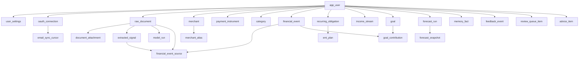

# Irene Schema Design

## 1. Purpose

This document defines the database design for Irene's MVP. It is the schema-level companion to [technical-architecture.md](/Users/subho/Documents/Workspace/Projects/irene/docs/technical-architecture.md) and [implementation-plan.md](/Users/subho/Documents/Workspace/Projects/irene/docs/implementation-plan.md).

Its job is to answer:

- what tables exist
- what each table stores
- the data type and intent of each column
- which constraints and indexes are required
- how records relate to each other
- how deletion, retention, and mutation should work
- in what order migrations should be created

This is a design document, not a generated migration file. It should be detailed enough to derive the first real Postgres migrations.

## 2. Design Principles

The schema should follow these rules:

1. Preserve raw source evidence separately from canonical finance truth.
2. Never let model output become canonical without a reconciliation step.
3. Optimize for correctness and traceability before optimization for analytics.
4. Store money in minor units.
5. Prefer append and audit patterns over silent mutation for sensitive workflows.
6. Keep the schema user-scoped even though the MVP is single-user.
7. Use flexible `text + check` state columns where values may evolve rapidly.

## 3. PostgreSQL Conventions

### 3.1 Extensions

Enable:

- `pgcrypto`
- `citext`
- `pg_trgm`
- `btree_gin`

Optional later:

- `pgvector`

### 3.2 Common Column Rules

- primary keys: `uuid`
- timestamp columns: `timestamptz`
- money amounts: `bigint` in minor currency units
- currency code: `varchar(3)` with uppercase ISO code expectation
- JSON payloads: `jsonb`
- string states and types: `text` with `check` constraints
- all tables with business state should include `created_at`
- mutable tables should include `updated_at`

### 3.3 ID Generation

All primary keys should default to `gen_random_uuid()`.

### 3.4 Timestamp Defaults

`created_at` and `updated_at` should default to `now()`.

### 3.5 Currency Rule

Where currency is stored, use `varchar(3)` with a check equivalent to:

- exactly 3 uppercase letters

## 4. Soft Delete and Retention Strategy

The canonical ledger should survive even if raw source data is removed or redacted later.

Schema policy:

- canonical tables should generally not be hard-deleted
- source tables may be redacted or purged later
- raw source rows should be retained at least through initial audit windows
- foreign keys from canonical records to raw source should avoid destructive cascade behavior

For the MVP, prefer source redaction over hard deletion. If hard deletion is later required, it should be introduced with explicit retention columns and migration steps rather than assumed now.

## 5. Enum and Check Constraint Catalog

For schema flexibility, most of these should be implemented as `text` columns with database `check` constraints, not Postgres enum types.

### 5.1 `oauth_connection.status`

Allowed values:

- `active`
- `expired`
- `revoked`
- `error`

### 5.2 `raw_document.source_type`

Allowed values:

- `email`
- `attachment_email`
- `forwarded_email`

### 5.3 `document_attachment.parse_status`

Allowed values:

- `pending`
- `processing`
- `completed`
- `failed`
- `skipped`

### 5.4 `model_run.task_type`

Allowed values:

- `document_extraction`
- `classification_support`
- `advice_generation`
- `review_summary`

### 5.5 `model_run.status`

Allowed values:

- `queued`
- `running`
- `succeeded`
- `failed`

### 5.6 `extracted_signal.signal_type`

Allowed values:

- `purchase_signal`
- `income_signal`
- `subscription_signal`
- `emi_signal`
- `bill_signal`
- `refund_signal`
- `transfer_signal`
- `generic_finance_signal`

### 5.7 `extracted_signal.candidate_event_type`

Allowed values:

- `purchase`
- `income`
- `subscription_charge`
- `emi_payment`
- `bill_payment`
- `refund`
- `transfer`

### 5.8 `extracted_signal.status`

Allowed values:

- `pending`
- `reconciled`
- `ignored`
- `needs_review`
- `failed`

### 5.9 `merchant.merchant_type`

Allowed values:

- `merchant`
- `biller`
- `lender`
- `employer`
- `bank`
- `wallet_provider`
- `marketplace`
- `person`
- `unknown`

### 5.10 `payment_instrument.instrument_type`

Allowed values:

- `credit_card`
- `debit_card`
- `bank_account`
- `wallet`
- `upi`
- `cash`
- `unknown`

### 5.11 `payment_instrument.status`

Allowed values:

- `active`
- `inactive`
- `closed`

### 5.12 `category.kind`

Allowed values:

- `expense`
- `income`
- `transfer`
- `savings`
- `debt`

### 5.13 `financial_event.event_type`

Allowed values:

- `purchase`
- `income`
- `subscription_charge`
- `emi_payment`
- `bill_payment`
- `refund`
- `transfer`

### 5.14 `financial_event.status`

Allowed values:

- `confirmed`
- `needs_review`
- `ignored`
- `reversed`

### 5.15 `financial_event.direction`

Allowed values:

- `inflow`
- `outflow`
- `neutral`

### 5.16 `recurring_obligation.obligation_type`

Allowed values:

- `subscription`
- `bill`
- `emi`

### 5.17 `recurring_obligation.status`

Allowed values:

- `suspected`
- `active`
- `paused`
- `closed`

### 5.18 `recurring_obligation.cadence`

Allowed values:

- `weekly`
- `monthly`
- `quarterly`
- `yearly`
- `irregular`

### 5.19 `emi_plan.status`

Allowed values:

- `suspected`
- `active`
- `completed`
- `cancelled`

### 5.20 `income_stream.income_type`

Allowed values:

- `salary`
- `freelance`
- `reimbursement`
- `transfer_in`
- `other`

### 5.21 `income_stream.status`

Allowed values:

- `active`
- `inactive`
- `suspected`

### 5.22 `goal.goal_type`

Allowed values:

- `emergency_fund`
- `savings_target`
- `debt_payoff`
- `purchase_fund`

### 5.23 `goal.status`

Allowed values:

- `active`
- `achieved`
- `paused`
- `archived`

### 5.24 `forecast_run.run_type`

Allowed values:

- `scheduled`
- `on_demand`
- `post_sync`
- `post_review`

### 5.25 `forecast_run.status`

Allowed values:

- `queued`
- `running`
- `succeeded`
- `failed`

### 5.26 `memory_fact.fact_type`

Allowed values:

- `merchant_category_default`
- `merchant_alias`
- `payment_instrument_default`
- `recurring_hint`
- `salary_day_hint`
- `transfer_rule`
- `ignore_rule`
- `user_note`

### 5.27 `feedback_event.feedback_type`

Allowed values:

- `accepted_suggestion`
- `rejected_suggestion`
- `recategorized_event`
- `edited_event`
- `resolved_review`
- `merged_merchant`
- `pinned_memory`

### 5.28 `review_queue_item.item_type`

Allowed values:

- `unknown_merchant`
- `ambiguous_transfer`
- `duplicate_candidate`
- `recurring_candidate`
- `emi_candidate`
- `low_confidence_event`
- `missing_field`

### 5.29 `review_queue_item.status`

Allowed values:

- `open`
- `resolved`
- `dismissed`
- `expired`

### 5.30 `advice_item.advice_type`

Allowed values:

- `overspending`
- `low_balance_risk`
- `salary_missing`
- `subscription_bloat`
- `emi_pressure`
- `goal_off_track`

### 5.31 `advice_item.severity`

Allowed values:

- `info`
- `warning`
- `critical`

### 5.32 `advice_item.status`

Allowed values:

- `active`
- `dismissed`
- `expired`

### 5.33 `job_run.status`

Allowed values:

- `queued`
- `running`
- `succeeded`
- `failed`
- `dead_lettered`
- `cancelled`

## 6. Table Design

## 6.1 Identity and Settings Layer

### `app_user`

Purpose:

- root user table
- single-user now, tenant anchor later

Columns:

- `id uuid pk not null default gen_random_uuid()`
- `email citext not null`
- `full_name text null`
- `timezone text not null`
- `default_currency varchar(3) not null`
- `created_at timestamptz not null default now()`
- `updated_at timestamptz not null default now()`

Indexes and constraints:

- primary key on `id`
- unique index on `email`
- check on `default_currency`

Foreign keys:

- none

Delete behavior:

- app root row should not be deleted in normal operation

### `user_settings`

Purpose:

- one-to-one settings row for product defaults and thresholds

Columns:

- `user_id uuid pk not null`
- `forecast_horizon_days integer not null default 30`
- `salary_day_hint integer null`
- `low_balance_threshold bigint not null default 0`
- `review_confidence_threshold numeric(5,4) not null default 0.7000`
- `auto_apply_confidence_threshold numeric(5,4) not null default 0.9500`
- `data_retention_days integer null`
- `created_at timestamptz not null default now()`
- `updated_at timestamptz not null default now()`

Indexes and constraints:

- primary key on `user_id`
- checks:
  - `forecast_horizon_days > 0`
  - `salary_day_hint between 1 and 31` when present
  - confidence fields between `0` and `1`

Foreign keys:

- `user_id -> app_user.id on delete cascade`

## 6.2 Source Ingestion Layer

### `oauth_connection`

Purpose:

- stores mailbox provider connection metadata and encrypted tokens

Columns:

- `id uuid pk not null default gen_random_uuid()`
- `user_id uuid not null`
- `provider text not null`
- `provider_account_email citext not null`
- `access_token_encrypted text not null`
- `refresh_token_encrypted text null`
- `token_expires_at timestamptz null`
- `scope text null`
- `status text not null`
- `last_successful_sync_at timestamptz null`
- `last_failed_sync_at timestamptz null`
- `created_at timestamptz not null default now()`
- `updated_at timestamptz not null default now()`

Indexes and constraints:

- unique index on `(user_id, provider, provider_account_email)`
- index on `(user_id, status)`
- check on `status`

Foreign keys:

- `user_id -> app_user.id on delete cascade`

### `email_sync_cursor`

Purpose:

- tracks sync position for each folder or logical mailbox stream

Columns:

- `id uuid pk not null default gen_random_uuid()`
- `oauth_connection_id uuid not null`
- `folder_name text not null`
- `provider_cursor text null`
- `backfill_started_at timestamptz null`
- `backfill_completed_at timestamptz null`
- `last_seen_message_at timestamptz null`
- `created_at timestamptz not null default now()`
- `updated_at timestamptz not null default now()`

Indexes and constraints:

- unique index on `(oauth_connection_id, folder_name)`
- index on `last_seen_message_at`

Foreign keys:

- `oauth_connection_id -> oauth_connection.id on delete cascade`

### `raw_document`

Purpose:

- durable normalized source record for every ingested email-like document

Columns:

- `id uuid pk not null default gen_random_uuid()`
- `user_id uuid not null`
- `oauth_connection_id uuid not null`
- `source_type text not null`
- `provider_message_id text not null`
- `thread_id text null`
- `message_timestamp timestamptz not null`
- `from_address citext null`
- `to_address citext null`
- `subject text null`
- `body_text text null`
- `body_html_storage_key text null`
- `snippet text null`
- `has_attachments boolean not null default false`
- `document_hash text not null`
- `ingested_at timestamptz not null default now()`
- `created_at timestamptz not null default now()`

Indexes and constraints:

- unique index on `(oauth_connection_id, provider_message_id)`
- index on `(user_id, message_timestamp desc)`
- index on `(user_id, thread_id)`
- index on `document_hash`
- check on `source_type`

Foreign keys:

- `user_id -> app_user.id on delete cascade`
- `oauth_connection_id -> oauth_connection.id on delete cascade`

Delete behavior:

- do not cascade delete into canonical finance tables

### `document_attachment`

Purpose:

- attachment metadata and parsed attachment text

Columns:

- `id uuid pk not null default gen_random_uuid()`
- `raw_document_id uuid not null`
- `filename text not null`
- `mime_type text not null`
- `storage_key text not null`
- `size_bytes bigint not null`
- `sha256_hash text not null`
- `parse_status text not null default 'pending'`
- `parsed_text text null`
- `created_at timestamptz not null default now()`
- `updated_at timestamptz not null default now()`

Indexes and constraints:

- index on `raw_document_id`
- index on `(parse_status, created_at)`
- unique index on `(raw_document_id, sha256_hash)`
- check `size_bytes >= 0`
- check on `parse_status`

Foreign keys:

- `raw_document_id -> raw_document.id on delete cascade`

## 6.3 Interpretation Layer

### `model_run`

Purpose:

- audit table for every model call

Columns:

- `id uuid pk not null default gen_random_uuid()`
- `user_id uuid not null`
- `raw_document_id uuid null`
- `task_type text not null`
- `provider text not null`
- `model_name text not null`
- `prompt_version text not null`
- `input_tokens integer null`
- `output_tokens integer null`
- `status text not null`
- `latency_ms integer null`
- `request_id text null`
- `error_message text null`
- `created_at timestamptz not null default now()`

Indexes and constraints:

- index on `(user_id, created_at desc)`
- index on `(raw_document_id, created_at desc)`
- index on `(task_type, status, created_at desc)`
- check on `task_type`
- check on `status`
- check `input_tokens >= 0` when present
- check `output_tokens >= 0` when present
- check `latency_ms >= 0` when present

Foreign keys:

- `user_id -> app_user.id on delete cascade`
- `raw_document_id -> raw_document.id on delete set null`

### `extracted_signal`

Purpose:

- stores candidate structured facts from source documents

Columns:

- `id uuid pk not null default gen_random_uuid()`
- `user_id uuid not null`
- `raw_document_id uuid not null`
- `model_run_id uuid null`
- `signal_type text not null`
- `candidate_event_type text null`
- `amount_minor bigint null`
- `currency varchar(3) null`
- `event_date date null`
- `merchant_raw text null`
- `merchant_hint text null`
- `payment_instrument_hint text null`
- `category_hint text null`
- `is_recurring_hint boolean not null default false`
- `is_emi_hint boolean not null default false`
- `confidence numeric(5,4) not null`
- `evidence_json jsonb not null default '{}'::jsonb`
- `status text not null default 'pending'`
- `created_at timestamptz not null default now()`
- `updated_at timestamptz not null default now()`

Indexes and constraints:

- index on `(raw_document_id, created_at)`
- index on `(user_id, status, created_at desc)`
- index on `(candidate_event_type, status)`
- GIN index on `evidence_json`
- check on `signal_type`
- check on `candidate_event_type` when present
- check on `status`
- check `confidence between 0 and 1`
- check on `currency` when present

Foreign keys:

- `user_id -> app_user.id on delete cascade`
- `raw_document_id -> raw_document.id on delete cascade`
- `model_run_id -> model_run.id on delete set null`

## 6.4 Canonical Finance Layer

### `merchant`

Purpose:

- canonical merchant table with user-specific normalization

Columns:

- `id uuid pk not null default gen_random_uuid()`
- `user_id uuid not null`
- `display_name text not null`
- `normalized_name text not null`
- `default_category text null`
- `merchant_type text not null default 'unknown'`
- `country_code varchar(2) null`
- `is_subscription_prone boolean not null default false`
- `is_emi_lender boolean not null default false`
- `last_seen_at timestamptz null`
- `created_at timestamptz not null default now()`
- `updated_at timestamptz not null default now()`

Indexes and constraints:

- unique index on `(user_id, normalized_name)`
- trigram index on `normalized_name`
- index on `(user_id, merchant_type)`
- check on `merchant_type`

Foreign keys:

- `user_id -> app_user.id on delete cascade`

Note:

- `default_category` remains text for MVP alignment with the architecture doc. It can later migrate to `default_category_id uuid` if tighter referential integrity becomes necessary.

### `merchant_alias`

Purpose:

- maps raw merchant strings to canonical merchants

Columns:

- `id uuid pk not null default gen_random_uuid()`
- `merchant_id uuid not null`
- `alias_text text not null`
- `alias_hash text not null`
- `source text not null`
- `confidence numeric(5,4) not null default 1.0000`
- `created_at timestamptz not null default now()`

Indexes and constraints:

- unique index on `(merchant_id, alias_hash)`
- index on `alias_hash`
- trigram index on `alias_text`
- check `confidence between 0 and 1`

Foreign keys:

- `merchant_id -> merchant.id on delete cascade`

### `payment_instrument`

Purpose:

- known payment sources and receiving instruments

Columns:

- `id uuid pk not null default gen_random_uuid()`
- `user_id uuid not null`
- `instrument_type text not null`
- `provider_name text null`
- `display_name text not null`
- `masked_identifier text null`
- `billing_cycle_day integer null`
- `payment_due_day integer null`
- `credit_limit_minor bigint null`
- `currency varchar(3) not null`
- `status text not null default 'active'`
- `created_at timestamptz not null default now()`
- `updated_at timestamptz not null default now()`

Indexes and constraints:

- index on `(user_id, instrument_type, status)`
- unique index on `(user_id, instrument_type, provider_name, masked_identifier)`
- check on `instrument_type`
- check on `status`
- check `billing_cycle_day between 1 and 31` when present
- check `payment_due_day between 1 and 31` when present
- check `credit_limit_minor >= 0` when present

Foreign keys:

- `user_id -> app_user.id on delete cascade`

### `category`

Purpose:

- user-scoped category tree

Columns:

- `id uuid pk not null default gen_random_uuid()`
- `user_id uuid not null`
- `parent_category_id uuid null`
- `name text not null`
- `slug text not null`
- `kind text not null`
- `is_system boolean not null default false`
- `created_at timestamptz not null default now()`
- `updated_at timestamptz not null default now()`

Indexes and constraints:

- unique index on `(user_id, slug)`
- index on `(user_id, kind)`
- index on `parent_category_id`
- check on `kind`

Foreign keys:

- `user_id -> app_user.id on delete cascade`
- `parent_category_id -> category.id on delete set null`

### `financial_event`

Purpose:

- canonical ledger event
- all downstream finance logic depends on this table

Columns:

- `id uuid pk not null default gen_random_uuid()`
- `user_id uuid not null`
- `event_type text not null`
- `status text not null default 'confirmed'`
- `direction text not null`
- `amount_minor bigint not null`
- `currency varchar(3) not null`
- `event_occurred_at timestamptz not null`
- `posted_at timestamptz null`
- `merchant_id uuid null`
- `payment_instrument_id uuid null`
- `category_id uuid null`
- `description text null`
- `notes text null`
- `confidence numeric(5,4) not null default 1.0000`
- `needs_review boolean not null default false`
- `is_recurring_candidate boolean not null default false`
- `is_transfer boolean not null default false`
- `source_count integer not null default 0`
- `created_at timestamptz not null default now()`
- `updated_at timestamptz not null default now()`

Indexes and constraints:

- index on `(user_id, event_occurred_at desc)`
- index on `(user_id, event_type, event_occurred_at desc)`
- index on `(merchant_id, event_occurred_at desc)`
- index on `(payment_instrument_id, event_occurred_at desc)`
- index on `(category_id, event_occurred_at desc)`
- index on `(status, needs_review)`
- check on `event_type`
- check on `status`
- check on `direction`
- check `confidence between 0 and 1`
- check `source_count >= 0`
- check `amount_minor >= 0`

Foreign keys:

- `user_id -> app_user.id on delete cascade`
- `merchant_id -> merchant.id on delete set null`
- `payment_instrument_id -> payment_instrument.id on delete set null`
- `category_id -> category.id on delete set null`

### `financial_event_source`

Purpose:

- explains where a canonical event came from

Columns:

- `id uuid pk not null default gen_random_uuid()`
- `financial_event_id uuid not null`
- `raw_document_id uuid null`
- `extracted_signal_id uuid null`
- `link_reason text not null`
- `created_at timestamptz not null default now()`

Indexes and constraints:

- index on `financial_event_id`
- index on `raw_document_id`
- index on `extracted_signal_id`
- check that at least one of `raw_document_id` or `extracted_signal_id` is non-null

Foreign keys:

- `financial_event_id -> financial_event.id on delete cascade`
- `raw_document_id -> raw_document.id on delete set null`
- `extracted_signal_id -> extracted_signal.id on delete set null`

### `recurring_obligation`

Purpose:

- recurring payment commitments detected or confirmed by the system

Columns:

- `id uuid pk not null default gen_random_uuid()`
- `user_id uuid not null`
- `obligation_type text not null`
- `status text not null default 'suspected'`
- `merchant_id uuid null`
- `payment_instrument_id uuid null`
- `category_id uuid null`
- `name text not null`
- `amount_minor bigint null`
- `currency varchar(3) null`
- `cadence text not null`
- `interval_count integer not null default 1`
- `day_of_month integer null`
- `next_due_at timestamptz null`
- `last_charged_at timestamptz null`
- `detection_confidence numeric(5,4) not null default 0.5000`
- `source_event_id uuid null`
- `created_at timestamptz not null default now()`
- `updated_at timestamptz not null default now()`

Indexes and constraints:

- index on `(user_id, status, next_due_at)`
- index on `(merchant_id, status)`
- index on `(payment_instrument_id, status)`
- check on `obligation_type`
- check on `status`
- check on `cadence`
- check `interval_count > 0`
- check `day_of_month between 1 and 31` when present
- check `detection_confidence between 0 and 1`

Foreign keys:

- `user_id -> app_user.id on delete cascade`
- `merchant_id -> merchant.id on delete set null`
- `payment_instrument_id -> payment_instrument.id on delete set null`
- `category_id -> category.id on delete set null`
- `source_event_id -> financial_event.id on delete set null`

### `emi_plan`

Purpose:

- detailed EMI representation layered on top of a recurring obligation

Columns:

- `id uuid pk not null default gen_random_uuid()`
- `user_id uuid not null`
- `recurring_obligation_id uuid not null`
- `merchant_id uuid null`
- `payment_instrument_id uuid null`
- `principal_minor bigint null`
- `installment_amount_minor bigint null`
- `currency varchar(3) null`
- `tenure_months integer null`
- `installments_paid integer not null default 0`
- `interest_rate_bps integer null`
- `start_date date null`
- `end_date date null`
- `next_due_at timestamptz null`
- `status text not null default 'suspected'`
- `confidence numeric(5,4) not null default 0.5000`
- `created_at timestamptz not null default now()`
- `updated_at timestamptz not null default now()`

Indexes and constraints:

- unique index on `recurring_obligation_id`
- index on `(user_id, status, next_due_at)`
- check on `status`
- check `installments_paid >= 0`
- check `tenure_months > 0` when present
- check `interest_rate_bps >= 0` when present
- check `confidence between 0 and 1`

Foreign keys:

- `user_id -> app_user.id on delete cascade`
- `recurring_obligation_id -> recurring_obligation.id on delete cascade`
- `merchant_id -> merchant.id on delete set null`
- `payment_instrument_id -> payment_instrument.id on delete set null`

### `income_stream`

Purpose:

- repeatable income patterns used for forecasting

Columns:

- `id uuid pk not null default gen_random_uuid()`
- `user_id uuid not null`
- `name text not null`
- `income_type text not null`
- `source_merchant_id uuid null`
- `payment_instrument_id uuid null`
- `expected_amount_minor bigint null`
- `currency varchar(3) null`
- `expected_day_of_month integer null`
- `variability_score numeric(5,4) not null default 0.0000`
- `last_received_at timestamptz null`
- `next_expected_at timestamptz null`
- `confidence numeric(5,4) not null default 0.5000`
- `status text not null default 'suspected'`
- `created_at timestamptz not null default now()`
- `updated_at timestamptz not null default now()`

Indexes and constraints:

- index on `(user_id, status, next_expected_at)`
- index on `(source_merchant_id, status)`
- check on `income_type`
- check on `status`
- check `expected_day_of_month between 1 and 31` when present
- check `variability_score between 0 and 1`
- check `confidence between 0 and 1`

Foreign keys:

- `user_id -> app_user.id on delete cascade`
- `source_merchant_id -> merchant.id on delete set null`
- `payment_instrument_id -> payment_instrument.id on delete set null`

## 6.5 Planning Layer

### `goal`

Purpose:

- user-defined financial goal

Columns:

- `id uuid pk not null default gen_random_uuid()`
- `user_id uuid not null`
- `name text not null`
- `goal_type text not null`
- `target_amount_minor bigint not null`
- `current_amount_minor bigint not null default 0`
- `currency varchar(3) not null`
- `target_date date null`
- `priority integer not null default 3`
- `status text not null default 'active'`
- `notes text null`
- `created_at timestamptz not null default now()`
- `updated_at timestamptz not null default now()`

Indexes and constraints:

- index on `(user_id, status, priority)`
- check on `goal_type`
- check on `status`
- check `target_amount_minor > 0`
- check `current_amount_minor >= 0`
- check `priority between 1 and 5`

Foreign keys:

- `user_id -> app_user.id on delete cascade`

### `goal_contribution`

Purpose:

- maps ledger events to goal progress contributions

Columns:

- `id uuid pk not null default gen_random_uuid()`
- `goal_id uuid not null`
- `financial_event_id uuid not null`
- `amount_minor bigint not null`
- `contribution_date date not null`
- `created_at timestamptz not null default now()`

Indexes and constraints:

- unique index on `(goal_id, financial_event_id)`
- index on `goal_id`
- index on `financial_event_id`
- check `amount_minor > 0`

Foreign keys:

- `goal_id -> goal.id on delete cascade`
- `financial_event_id -> financial_event.id on delete cascade`

### `forecast_run`

Purpose:

- represents one execution of the forecast engine

Columns:

- `id uuid pk not null default gen_random_uuid()`
- `user_id uuid not null`
- `run_type text not null`
- `horizon_days integer not null`
- `baseline_date date not null`
- `status text not null`
- `inputs_hash text not null`
- `created_at timestamptz not null default now()`
- `completed_at timestamptz null`

Indexes and constraints:

- index on `(user_id, created_at desc)`
- index on `(user_id, status, created_at desc)`
- unique index on `(user_id, run_type, baseline_date, inputs_hash)`
- check on `run_type`
- check on `status`
- check `horizon_days > 0`

Foreign keys:

- `user_id -> app_user.id on delete cascade`

### `forecast_snapshot`

Purpose:

- stores forecast results per future date

Columns:

- `id uuid pk not null default gen_random_uuid()`
- `forecast_run_id uuid not null`
- `snapshot_date date not null`
- `projected_balance_minor bigint not null`
- `projected_income_minor bigint not null default 0`
- `projected_fixed_outflow_minor bigint not null default 0`
- `projected_variable_outflow_minor bigint not null default 0`
- `projected_emi_outflow_minor bigint not null default 0`
- `safe_to_spend_minor bigint not null default 0`
- `confidence_band_low_minor bigint null`
- `confidence_band_high_minor bigint null`
- `created_at timestamptz not null default now()`

Indexes and constraints:

- unique index on `(forecast_run_id, snapshot_date)`
- index on `snapshot_date`

Foreign keys:

- `forecast_run_id -> forecast_run.id on delete cascade`

## 6.6 Learning Layer

### `memory_fact`

Purpose:

- persistent explicit and learned finance memory

Columns:

- `id uuid pk not null default gen_random_uuid()`
- `user_id uuid not null`
- `fact_type text not null`
- `subject_type text not null`
- `subject_id uuid null`
- `key text not null`
- `value_json jsonb not null`
- `confidence numeric(5,4) not null default 1.0000`
- `source text not null`
- `source_reference_id uuid null`
- `is_user_pinned boolean not null default false`
- `first_observed_at timestamptz null`
- `last_confirmed_at timestamptz null`
- `expires_at timestamptz null`
- `created_at timestamptz not null default now()`
- `updated_at timestamptz not null default now()`

Indexes and constraints:

- index on `(user_id, fact_type, key)`
- index on `(subject_type, subject_id)`
- index on `(user_id, is_user_pinned, expires_at)`
- GIN index on `value_json`
- check on `fact_type`
- check `confidence between 0 and 1`

Foreign keys:

- `user_id -> app_user.id on delete cascade`

Notes:

- `subject_type` is polymorphic and intentionally not foreign-key constrained.
- `source_reference_id` is also polymorphic and intentionally not foreign-key constrained.

### `feedback_event`

Purpose:

- immutable log of user corrections and confirmations

Columns:

- `id uuid pk not null default gen_random_uuid()`
- `user_id uuid not null`
- `feedback_type text not null`
- `target_type text not null`
- `target_id uuid not null`
- `previous_value_json jsonb null`
- `new_value_json jsonb not null`
- `reason text null`
- `created_at timestamptz not null default now()`

Indexes and constraints:

- index on `(user_id, created_at desc)`
- index on `(target_type, target_id, created_at desc)`
- check on `feedback_type`

Foreign keys:

- `user_id -> app_user.id on delete cascade`

Notes:

- `target_type` and `target_id` are polymorphic and intentionally not foreign-key constrained.

### `review_queue_item`

Purpose:

- unresolved items awaiting human confirmation or correction

Columns:

- `id uuid pk not null default gen_random_uuid()`
- `user_id uuid not null`
- `item_type text not null`
- `status text not null default 'open'`
- `priority integer not null default 3`
- `raw_document_id uuid null`
- `extracted_signal_id uuid null`
- `financial_event_id uuid null`
- `title text not null`
- `explanation text not null`
- `proposed_resolution_json jsonb not null default '{}'::jsonb`
- `created_at timestamptz not null default now()`
- `resolved_at timestamptz null`

Indexes and constraints:

- index on `(user_id, status, priority, created_at)`
- index on `raw_document_id`
- index on `extracted_signal_id`
- index on `financial_event_id`
- check on `item_type`
- check on `status`
- check `priority between 1 and 5`
- check that at least one of `raw_document_id`, `extracted_signal_id`, or `financial_event_id` is non-null

Foreign keys:

- `user_id -> app_user.id on delete cascade`
- `raw_document_id -> raw_document.id on delete set null`
- `extracted_signal_id -> extracted_signal.id on delete set null`
- `financial_event_id -> financial_event.id on delete set null`

## 6.7 Advice and Operations Layer

### `advice_item`

Purpose:

- user-facing recommendations grounded in structured state

Columns:

- `id uuid pk not null default gen_random_uuid()`
- `user_id uuid not null`
- `advice_type text not null`
- `severity text not null`
- `status text not null default 'active'`
- `title text not null`
- `body text not null`
- `explanation_json jsonb not null default '{}'::jsonb`
- `trigger_data_json jsonb not null default '{}'::jsonb`
- `confidence numeric(5,4) not null default 0.5000`
- `effective_from timestamptz null`
- `effective_to timestamptz null`
- `created_at timestamptz not null default now()`
- `updated_at timestamptz not null default now()`

Indexes and constraints:

- index on `(user_id, status, severity, created_at desc)`
- index on `(user_id, advice_type, status)`
- GIN index on `trigger_data_json`
- check on `advice_type`
- check on `severity`
- check on `status`
- check `confidence between 0 and 1`

Foreign keys:

- `user_id -> app_user.id on delete cascade`

### `job_run`

Purpose:

- operational history of background jobs

Columns:

- `id uuid pk not null default gen_random_uuid()`
- `queue_name text not null`
- `job_name text not null`
- `job_key text null`
- `payload_json jsonb null`
- `status text not null`
- `attempt_count integer not null default 0`
- `started_at timestamptz null`
- `completed_at timestamptz null`
- `error_message text null`
- `created_at timestamptz not null default now()`

Indexes and constraints:

- index on `(queue_name, status, created_at desc)`
- index on `job_name`
- index on `job_key`
- check on `status`
- check `attempt_count >= 0`

Foreign keys:

- none

## 7. Relationship Overview

## 8. Indexing Strategy

The first migration set should include all lookup indexes needed by core workflows.

Required indexing patterns:

- reverse chronological indexes for timeline queries
- status-plus-time indexes for workers
- uniqueness on provider and sync identifiers
- trigram indexes for merchant and alias matching
- GIN indexes on JSON columns used in operations or debugging

Do not add speculative analytics indexes in the first pass.

## 9. Recommended Migration Order

Create migrations in this order:

1. extensions
2. `app_user`, `user_settings`
3. `oauth_connection`, `email_sync_cursor`
4. `raw_document`, `document_attachment`
5. `model_run`, `extracted_signal`
6. `merchant`, `merchant_alias`, `payment_instrument`, `category`
7. `financial_event`, `financial_event_source`
8. `recurring_obligation`, `emi_plan`, `income_stream`
9. `goal`, `goal_contribution`
10. `forecast_run`, `forecast_snapshot`
11. `memory_fact`, `feedback_event`, `review_queue_item`
12. `advice_item`, `job_run`
13. secondary indexes and constraint refinements

## 10. Data Integrity Rules

These rules matter at the application layer even when they are not fully expressible as direct foreign keys:

- one mailbox message should map to one `raw_document`
- one `financial_event` may have multiple source links
- `goal.current_amount_minor` should be derived or reconciled from contributions, not freely drift
- `recurring_obligation` and `emi_plan` should never silently diverge on status
- `memory_fact` and `feedback_event` should be append-friendly and audit-safe
- advice should always be reproducible from stored trigger inputs

## 11. Future Schema Extensions

These are intentionally deferred from the MVP:

- bank account statement imports
- vector-backed semantic memory
- event-level balance snapshots per instrument
- tax-related entities
- attachment OCR-specific tables
- materialized views for analytics

## 12. Final Position

The most important schema boundary in Irene is the separation between:

- source evidence
- interpreted candidates
- canonical finance truth
- learned memory

If that boundary stays clean, the application will remain debuggable and trustworthy even as more AI behavior is added later.

