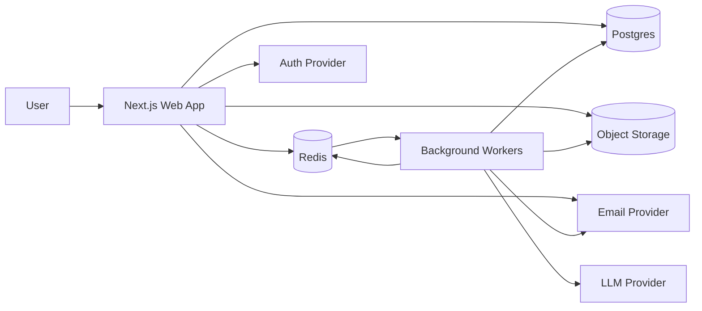
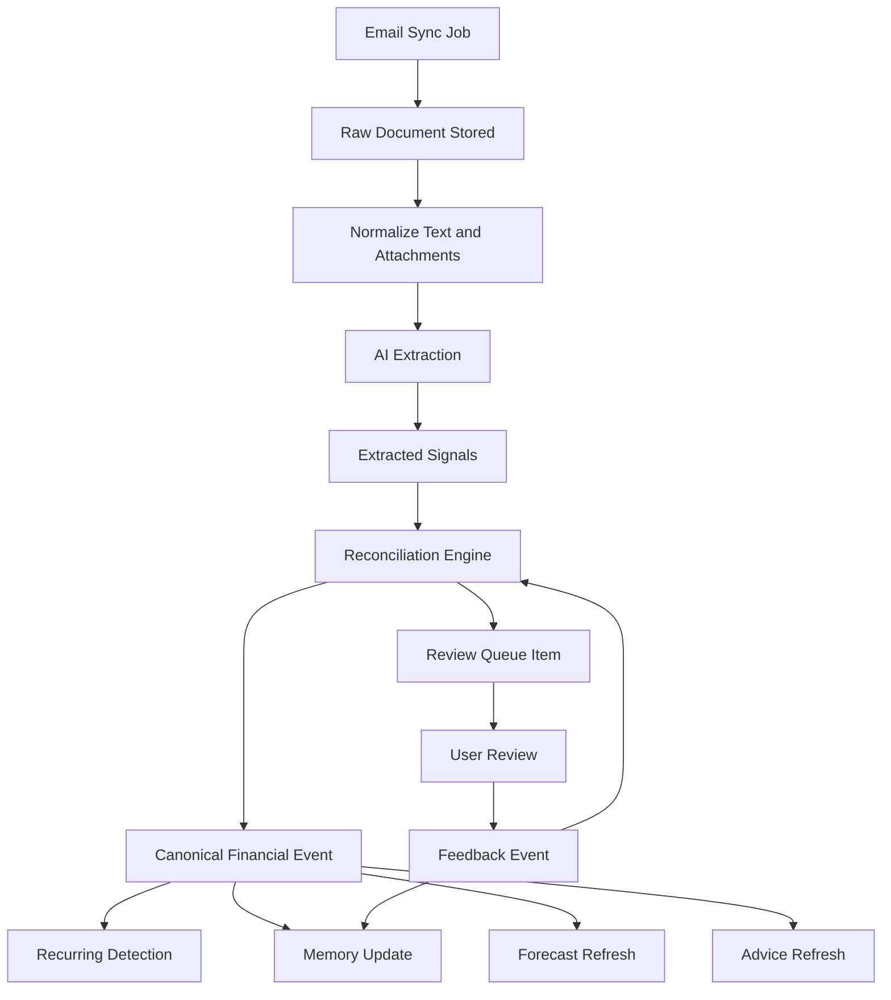
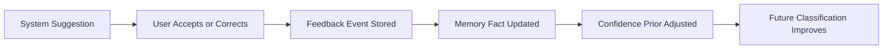

# Irene Technical Architecture

## 1. Document Purpose

This document defines the target technical architecture for Irene, a single-user AI-native personal finance tracker and planner. It is written to serve as the implementation baseline for product, engineering, and future contributors.

The document explains:

- what the app does
- what data it ingests
- how the data flows through the system
- how AI is used safely and predictably
- how background workflows are orchestrated
- how the database is structured
- how forecasting, memory, and auto-learning work
- what must be built to deliver the MVP

This is intentionally opinionated. It prefers durable, inspectable financial data over opaque AI behavior.

## 2. Product Summary

Irene is a private, single-user finance operating system built around the idea that personal finance can be reconstructed from everyday digital traces, starting with email. The app reads email-derived financial signals, converts them into structured financial events, maintains a personal financial memory, forecasts near-term financial status, and offers planning guidance.

For the MVP, Irene is not a bank-integrations platform and not a tax product. It is a structured finance intelligence layer for one person.

## 3. MVP Scope

The MVP includes:

- email ingestion from connected mailbox providers
- extraction of purchase, income, EMI, subscription, refund, transfer, and bill signals
- reconciliation into a canonical financial ledger
- merchant normalization and category assignment
- recurring obligation detection
- near-term forecast generation for cash flow and obligations
- goal tracking for a small set of financial goals
- advice generation based on structured triggers
- review queue for ambiguous items
- persistent memory and user-specific learning from corrections

The MVP excludes:

- direct bank API integrations
- formal investment portfolio tracking
- tax filing features
- autonomous money movement
- automated financial product recommendations
- multi-user tenancy and collaboration

## 4. Product Principles

The architecture follows these principles:

1. Structured truth beats raw AI output.
2. Every important inference should be explainable.
3. The user should be able to correct the system quickly.
4. Corrections should improve future behavior.
5. Sensitive data should be minimized, isolated, and auditable.
6. Long-running processing must not block the frontend.
7. Forecasts and advice should express confidence and assumptions.

## 5. High-Level User Experience

At a user level, Irene works like this:

1. The user connects an email account.
2. Irene syncs financial emails and attachments.
3. The system extracts candidate financial events.
4. These candidates are reconciled into canonical ledger entries.
5. Ambiguous items go to a review queue.
6. Confirmed events update obligations, forecasts, memory, and advice.
7. The dashboard shows:
   - spending
   - upcoming EMIs and bills
   - subscriptions
   - salary/income expectations
   - projected balances
   - safe-to-spend estimates
   - goal progress
   - action-oriented advice

## 6. Architecture Overview

Irene should be built as a TypeScript monorepo with a web application, a background worker service, and a shared domain layer.

### 6.1 Runtime Components

- `apps/web`
  - Next.js App Router frontend
  - authenticated UI
  - user-facing APIs
  - OAuth callback endpoints
  - review actions
  - settings and dashboard

- `apps/worker`
  - dedicated worker process
  - BullMQ consumers
  - AI extraction jobs
  - sync jobs
  - recurring detection jobs
  - forecast refresh jobs
  - advice generation jobs

- `Postgres`
  - primary source of truth
  - relational financial data
  - memory and feedback store
  - audit and workflow state

- `Redis`
  - queue backend
  - rate limiting
  - transient locks
  - delayed job scheduling

- `Object Storage`
  - optional but recommended
  - raw email bodies if large
  - attachments and parsed documents

- `LLM / AI provider`
  - structured extraction
  - classification support
  - advice phrasing
  - summary generation

### 6.2 Recommended Stack

- frontend and API: Next.js
- async work orchestration: BullMQ + Redis
- primary database: Postgres
- ORM / query layer: Drizzle or Prisma
- validation: Zod
- auth: NextAuth/Auth.js or Clerk
- observability: OpenTelemetry + application logs
- hosting:
  - Next.js on Vercel or a Node platform
  - workers on a long-lived Node runtime
  - Postgres on Neon, Supabase, RDS, or equivalent
  - Redis on Upstash or managed Redis

## 7. Why The System Is Split This Way

The web app should only handle fast user-facing interactions. Email sync, parsing, extraction, and forecasting are not safe to run inline with page requests because they are slow, failure-prone, and often need retries.

BullMQ is preferred because the app has clear job classes:

- mailbox synchronization
- backfill imports
- document parsing
- extraction and classification
- reconciliation
- recurring pattern detection
- forecast rebuilds
- advice generation

These are independently retryable and should not share a single synchronous request lifecycle.

## 8. Runtime Topology



## 9. Monorepo Structure

```text
apps/
  web/
  worker/
packages/
  db/
  domain/
  ai/
  workflows/
  config/
  observability/
  ui/
docs/
  technical-architecture.md
```

### 9.1 Package Responsibilities

- `packages/db`
  - schema
  - migrations
  - database client
  - repository functions

- `packages/domain`
  - financial types
  - enums
  - core business rules
  - reconciliation policies
  - forecast logic

- `packages/ai`
  - extraction prompts
  - model adapters
  - structured output parsers
  - context assembly for memory-aware classification

- `packages/workflows`
  - queue names
  - payload schemas
  - job step contracts
  - orchestration helpers

- `packages/config`
  - environment config
  - feature flags
  - provider setup

- `packages/observability`
  - logging
  - tracing
  - job instrumentation

## 10. Application Modules

The app should be split into these functional modules:

### 10.1 Identity and Access

- single primary user model
- session handling
- provider credentials and tokens
- secrets management

### 10.2 Data Ingestion

- email OAuth connection
- mailbox sync cursor management
- raw email and attachment capture
- deduplication by provider message id

### 10.3 Document Understanding

- HTML/plain-text normalization
- attachment parsing
- language-independent field extraction
- document-type classification

### 10.4 Financial Event Reconciliation

- merge candidate signals
- create canonical financial events
- match against merchants and recurring obligations
- prevent duplicates
- attach confidence and evidence

### 10.5 Ledger and Planning

- maintain all confirmed financial events
- categorize events
- attach to goals and obligations
- power dashboard calculations

### 10.6 Memory and Learning

- explicit user rules
- learned merchant/category behavior
- user corrections and confirmations
- confidence calibration

### 10.7 Forecasting

- deterministic upcoming obligations
- expected income timing
- expected discretionary spending band
- cash runway projections

### 10.8 Advice and Insights

- rule-based triggers
- AI-generated phrasing
- explanation and confidence metadata

### 10.9 Review Queue

- ambiguous events
- missing fields
- suspected duplicates
- recurring-detection confirmations

## 11. Core Data Flow



## 12. Processing Model

The system uses a pipeline architecture with durable checkpoints.

### 12.1 Ingestion Stage

The ingestion layer pulls messages from the configured mailbox provider and writes each message to `raw_document`. This stage should never create ledger entries directly.

### 12.2 Extraction Stage

The extraction layer converts raw emails into `extracted_signal` rows. These are hypotheses, not truth. Each signal may capture:

- detected event type
- amount
- currency
- merchant guess
- date
- payment instrument hint
- candidate category
- recurring hint
- EMI hint
- confidence
- evidence snippets

### 12.3 Reconciliation Stage

The reconciliation engine decides whether each signal:

- creates a new `financial_event`
- updates or enriches an existing `financial_event`
- attaches to an existing `recurring_obligation`
- should be ignored
- should be sent to `review_queue_item`

Reconciliation is a core business-logic layer and should not be treated as a pure AI operation.

### 12.4 Downstream Update Stage

Once a `financial_event` is confirmed or sufficiently trusted, downstream jobs update:

- recurring obligations
- EMI plan state
- merchant defaults
- memory facts
- forecast snapshots
- advice items

## 13. Queues and Jobs

Recommended BullMQ queues:

- `email-sync`
- `document-normalization`
- `ai-extraction`
- `reconciliation`
- `recurring-detection`
- `forecast-refresh`
- `advice-refresh`
- `review-followup`
- `backfill-import`

### 13.1 Job Policies

Each queue should define:

- concurrency
- retry strategy
- exponential backoff
- dead-letter handling
- idempotency key format
- structured logging fields

### 13.2 Job Idempotency

Jobs must be idempotent because mailbox sync and provider retries may deliver overlapping data. Idempotency keys should include provider message ids, sync window bounds, and canonical entity identifiers where appropriate.

## 14. Canonical Financial Objects

The app should standardize around these core objects:

- `financial_event`
  - one canonical money event
- `merchant`
  - normalized merchant entity
- `payment_instrument`
  - card, bank account, wallet, UPI source
- `recurring_obligation`
  - recurring payment commitment
- `emi_plan`
  - installment-based debt schedule
- `income_stream`
  - salary or repeatable income pattern
- `goal`
  - savings or payoff objective
- `memory_fact`
  - persistent personal financial knowledge
- `advice_item`
  - actionable insight

## 15. Database Design

The database should preserve both raw evidence and normalized truth.

### 15.1 Logical Data Layers

- source layer
  - raw provider data and sync state
- interpretation layer
  - extraction outputs, review items, model runs
- canonical finance layer
  - ledger, obligations, goals, forecasts
- learning layer
  - memory facts, feedback, merchant defaults
- operations layer
  - job runs, processing traces

### 15.2 PostgreSQL Extensions

Recommended:

- `pgcrypto` for encryption helpers and UUID support if needed
- `citext` for case-insensitive identifiers and emails
- `btree_gin` for mixed indexing use cases
- `pg_trgm` for merchant alias matching
- `pgvector` only if semantic memory search is introduced later

## 16. Database Schema Catalog

### 16.1 `app_user`

Represents the signed-in user. Irene is single-user for now, but user-scoped tables keep future expansion possible.

Columns:

- `id`
- `email`
- `full_name`
- `timezone`
- `default_currency`
- `created_at`
- `updated_at`

### 16.2 `user_settings`

User-level configuration and product defaults.

Columns:

- `user_id`
- `forecast_horizon_days`
- `salary_day_hint`
- `low_balance_threshold`
- `review_confidence_threshold`
- `auto_apply_confidence_threshold`
- `data_retention_days`
- `created_at`
- `updated_at`

### 16.3 `oauth_connection`

Stores provider connection metadata and encrypted tokens.

Columns:

- `id`
- `user_id`
- `provider`
- `provider_account_email`
- `access_token_encrypted`
- `refresh_token_encrypted`
- `token_expires_at`
- `scope`
- `status`
- `last_successful_sync_at`
- `last_failed_sync_at`
- `created_at`
- `updated_at`

### 16.4 `email_sync_cursor`

Tracks mailbox sync progress.

Columns:

- `id`
- `oauth_connection_id`
- `folder_name`
- `provider_cursor`
- `backfill_started_at`
- `backfill_completed_at`
- `last_seen_message_at`
- `created_at`
- `updated_at`

### 16.5 `raw_document`

Stores normalized source documents such as emails.

Columns:

- `id`
- `user_id`
- `oauth_connection_id`
- `source_type`
- `provider_message_id`
- `thread_id`
- `message_timestamp`
- `from_address`
- `to_address`
- `subject`
- `body_text`
- `body_html_storage_key`
- `snippet`
- `has_attachments`
- `document_hash`
- `ingested_at`
- `created_at`

### 16.6 `document_attachment`

Stores attachment metadata and parse state.

Columns:

- `id`
- `raw_document_id`
- `filename`
- `mime_type`
- `storage_key`
- `size_bytes`
- `sha256_hash`
- `parse_status`
- `parsed_text`
- `created_at`
- `updated_at`

### 16.7 `model_run`

Tracks every model invocation for auditing and debugging.

Columns:

- `id`
- `user_id`
- `raw_document_id`
- `task_type`
- `provider`
- `model_name`
- `prompt_version`
- `input_tokens`
- `output_tokens`
- `status`
- `latency_ms`
- `request_id`
- `error_message`
- `created_at`

### 16.8 `extracted_signal`

Stores structured extraction candidates produced by deterministic parsing or AI.

Columns:

- `id`
- `user_id`
- `raw_document_id`
- `model_run_id`
- `signal_type`
- `candidate_event_type`
- `amount_minor`
- `currency`
- `event_date`
- `merchant_raw`
- `merchant_hint`
- `payment_instrument_hint`
- `category_hint`
- `is_recurring_hint`
- `is_emi_hint`
- `confidence`
- `evidence_json`
- `status`
- `created_at`
- `updated_at`

### 16.9 `merchant`

Canonical merchant table.

Columns:

- `id`
- `user_id`
- `display_name`
- `normalized_name`
- `default_category`
- `merchant_type`
- `country_code`
- `is_subscription_prone`
- `is_emi_lender`
- `last_seen_at`
- `created_at`
- `updated_at`

### 16.10 `merchant_alias`

Maps multiple raw names to one merchant.

Columns:

- `id`
- `merchant_id`
- `alias_text`
- `alias_hash`
- `source`
- `confidence`
- `created_at`

### 16.11 `payment_instrument`

Stores cards, bank accounts, wallets, and similar sources of payment or receipt.

Columns:

- `id`
- `user_id`
- `instrument_type`
- `provider_name`
- `display_name`
- `masked_identifier`
- `billing_cycle_day`
- `payment_due_day`
- `credit_limit_minor`
- `currency`
- `status`
- `created_at`
- `updated_at`

### 16.12 `category`

Controlled user-scoped category tree.

Columns:

- `id`
- `user_id`
- `parent_category_id`
- `name`
- `slug`
- `kind`
- `is_system`
- `created_at`
- `updated_at`

### 16.13 `financial_event`

The canonical ledger object. This is the most important table.

Columns:

- `id`
- `user_id`
- `event_type`
- `status`
- `direction`
- `amount_minor`
- `currency`
- `event_occurred_at`
- `posted_at`
- `merchant_id`
- `payment_instrument_id`
- `category_id`
- `description`
- `notes`
- `confidence`
- `needs_review`
- `is_recurring_candidate`
- `is_transfer`
- `source_count`
- `created_at`
- `updated_at`

### 16.14 `financial_event_source`

Links source documents and signals to canonical financial events.

Columns:

- `id`
- `financial_event_id`
- `raw_document_id`
- `extracted_signal_id`
- `link_reason`
- `created_at`

### 16.15 `recurring_obligation`

Represents recurring payment commitments such as subscriptions, bills, or EMIs.

Columns:

- `id`
- `user_id`
- `obligation_type`
- `status`
- `merchant_id`
- `payment_instrument_id`
- `category_id`
- `name`
- `amount_minor`
- `currency`
- `cadence`
- `interval_count`
- `day_of_month`
- `next_due_at`
- `last_charged_at`
- `detection_confidence`
- `source_event_id`
- `created_at`
- `updated_at`

### 16.16 `emi_plan`

Represents installment-based debt commitments.

Columns:

- `id`
- `user_id`
- `recurring_obligation_id`
- `merchant_id`
- `payment_instrument_id`
- `principal_minor`
- `installment_amount_minor`
- `currency`
- `tenure_months`
- `installments_paid`
- `interest_rate_bps`
- `start_date`
- `end_date`
- `next_due_at`
- `status`
- `confidence`
- `created_at`
- `updated_at`

### 16.17 `income_stream`

Represents stable or semi-stable repeatable income patterns.

Columns:

- `id`
- `user_id`
- `name`
- `income_type`
- `source_merchant_id`
- `payment_instrument_id`
- `expected_amount_minor`
- `currency`
- `expected_day_of_month`
- `variability_score`
- `last_received_at`
- `next_expected_at`
- `confidence`
- `status`
- `created_at`
- `updated_at`

### 16.18 `goal`

Tracks user financial goals.

Columns:

- `id`
- `user_id`
- `name`
- `goal_type`
- `target_amount_minor`
- `current_amount_minor`
- `currency`
- `target_date`
- `priority`
- `status`
- `notes`
- `created_at`
- `updated_at`

### 16.19 `goal_contribution`

Tracks progress contributions toward goals.

Columns:

- `id`
- `goal_id`
- `financial_event_id`
- `amount_minor`
- `contribution_date`
- `created_at`

### 16.20 `forecast_run`

Represents a forecast generation run.

Columns:

- `id`
- `user_id`
- `run_type`
- `horizon_days`
- `baseline_date`
- `status`
- `inputs_hash`
- `created_at`
- `completed_at`

### 16.21 `forecast_snapshot`

Stores future-date projections produced by a forecast run.

Columns:

- `id`
- `forecast_run_id`
- `snapshot_date`
- `projected_balance_minor`
- `projected_income_minor`
- `projected_fixed_outflow_minor`
- `projected_variable_outflow_minor`
- `projected_emi_outflow_minor`
- `safe_to_spend_minor`
- `confidence_band_low_minor`
- `confidence_band_high_minor`
- `created_at`

### 16.22 `memory_fact`

The explicit and learned memory layer.

Columns:

- `id`
- `user_id`
- `fact_type`
- `subject_type`
- `subject_id`
- `key`
- `value_json`
- `confidence`
- `source`
- `source_reference_id`
- `is_user_pinned`
- `first_observed_at`
- `last_confirmed_at`
- `expires_at`
- `created_at`
- `updated_at`

### 16.23 `feedback_event`

Captures user actions that teach the system.

Columns:

- `id`
- `user_id`
- `feedback_type`
- `target_type`
- `target_id`
- `previous_value_json`
- `new_value_json`
- `reason`
- `created_at`

### 16.24 `review_queue_item`

Stores unresolved items needing user confirmation or correction.

Columns:

- `id`
- `user_id`
- `item_type`
- `status`
- `priority`
- `raw_document_id`
- `extracted_signal_id`
- `financial_event_id`
- `title`
- `explanation`
- `proposed_resolution_json`
- `created_at`
- `resolved_at`

### 16.25 `advice_item`

Represents user-facing advice or alerts.

Columns:

- `id`
- `user_id`
- `advice_type`
- `severity`
- `status`
- `title`
- `body`
- `explanation_json`
- `trigger_data_json`
- `confidence`
- `effective_from`
- `effective_to`
- `created_at`
- `updated_at`

### 16.26 `job_run`

Operational tracking for background workflows.

Columns:

- `id`
- `queue_name`
- `job_name`
- `job_key`
- `payload_json`
- `status`
- `attempt_count`
- `started_at`
- `completed_at`
- `error_message`
- `created_at`

## 17. Database ER Diagram

```mermaid
erDiagram
    app_user {
        uuid id PK
        citext email
        text full_name
        text timezone
        text default_currency
        timestamptz created_at
        timestamptz updated_at
    }

    user_settings {
        uuid user_id PK,FK
        integer forecast_horizon_days
        integer salary_day_hint
        bigint low_balance_threshold
        numeric review_confidence_threshold
        numeric auto_apply_confidence_threshold
        integer data_retention_days
        timestamptz created_at
        timestamptz updated_at
    }

    oauth_connection {
        uuid id PK
        uuid user_id FK
        text provider
        citext provider_account_email
        text access_token_encrypted
        text refresh_token_encrypted
        timestamptz token_expires_at
        text scope
        text status
        timestamptz last_successful_sync_at
        timestamptz last_failed_sync_at
        timestamptz created_at
        timestamptz updated_at
    }

    email_sync_cursor {
        uuid id PK
        uuid oauth_connection_id FK
        text folder_name
        text provider_cursor
        timestamptz backfill_started_at
        timestamptz backfill_completed_at
        timestamptz last_seen_message_at
        timestamptz created_at
        timestamptz updated_at
    }

    raw_document {
        uuid id PK
        uuid user_id FK
        uuid oauth_connection_id FK
        text source_type
        text provider_message_id
        text thread_id
        timestamptz message_timestamp
        citext from_address
        citext to_address
        text subject
        text body_text
        text body_html_storage_key
        text snippet
        boolean has_attachments
        text document_hash
        timestamptz ingested_at
        timestamptz created_at
    }

    document_attachment {
        uuid id PK
        uuid raw_document_id FK
        text filename
        text mime_type
        text storage_key
        bigint size_bytes
        text sha256_hash
        text parse_status
        text parsed_text
        timestamptz created_at
        timestamptz updated_at
    }

    model_run {
        uuid id PK
        uuid user_id FK
        uuid raw_document_id FK
        text task_type
        text provider
        text model_name
        text prompt_version
        integer input_tokens
        integer output_tokens
        text status
        integer latency_ms
        text request_id
        text error_message
        timestamptz created_at
    }

    extracted_signal {
        uuid id PK
        uuid user_id FK
        uuid raw_document_id FK
        uuid model_run_id FK
        text signal_type
        text candidate_event_type
        bigint amount_minor
        text currency
        date event_date
        text merchant_raw
        text merchant_hint
        text payment_instrument_hint
        text category_hint
        boolean is_recurring_hint
        boolean is_emi_hint
        numeric confidence
        jsonb evidence_json
        text status
        timestamptz created_at
        timestamptz updated_at
    }

    merchant {
        uuid id PK
        uuid user_id FK
        text display_name
        text normalized_name
        text default_category
        text merchant_type
        text country_code
        boolean is_subscription_prone
        boolean is_emi_lender
        timestamptz last_seen_at
        timestamptz created_at
        timestamptz updated_at
    }

    merchant_alias {
        uuid id PK
        uuid merchant_id FK
        text alias_text
        text alias_hash
        text source
        numeric confidence
        timestamptz created_at
    }

    payment_instrument {
        uuid id PK
        uuid user_id FK
        text instrument_type
        text provider_name
        text display_name
        text masked_identifier
        integer billing_cycle_day
        integer payment_due_day
        bigint credit_limit_minor
        text currency
        text status
        timestamptz created_at
        timestamptz updated_at
    }

    category {
        uuid id PK
        uuid user_id FK
        uuid parent_category_id FK
        text name
        text slug
        text kind
        boolean is_system
        timestamptz created_at
        timestamptz updated_at
    }

    financial_event {
        uuid id PK
        uuid user_id FK
        text event_type
        text status
        text direction
        bigint amount_minor
        text currency
        timestamptz event_occurred_at
        timestamptz posted_at
        uuid merchant_id FK
        uuid payment_instrument_id FK
        uuid category_id FK
        text description
        text notes
        numeric confidence
        boolean needs_review
        boolean is_recurring_candidate
        boolean is_transfer
        integer source_count
        timestamptz created_at
        timestamptz updated_at
    }

    financial_event_source {
        uuid id PK
        uuid financial_event_id FK
        uuid raw_document_id FK
        uuid extracted_signal_id FK
        text link_reason
        timestamptz created_at
    }

    recurring_obligation {
        uuid id PK
        uuid user_id FK
        text obligation_type
        text status
        uuid merchant_id FK
        uuid payment_instrument_id FK
        uuid category_id FK
        text name
        bigint amount_minor
        text currency
        text cadence
        integer interval_count
        integer day_of_month
        timestamptz next_due_at
        timestamptz last_charged_at
        numeric detection_confidence
        uuid source_event_id FK
        timestamptz created_at
        timestamptz updated_at
    }

    emi_plan {
        uuid id PK
        uuid user_id FK
        uuid recurring_obligation_id FK
        uuid merchant_id FK
        uuid payment_instrument_id FK
        bigint principal_minor
        bigint installment_amount_minor
        text currency
        integer tenure_months
        integer installments_paid
        integer interest_rate_bps
        date start_date
        date end_date
        timestamptz next_due_at
        text status
        numeric confidence
        timestamptz created_at
        timestamptz updated_at
    }

    income_stream {
        uuid id PK
        uuid user_id FK
        text name
        text income_type
        uuid source_merchant_id FK
        uuid payment_instrument_id FK
        bigint expected_amount_minor
        text currency
        integer expected_day_of_month
        numeric variability_score
        timestamptz last_received_at
        timestamptz next_expected_at
        numeric confidence
        text status
        timestamptz created_at
        timestamptz updated_at
    }

    goal {
        uuid id PK
        uuid user_id FK
        text name
        text goal_type
        bigint target_amount_minor
        bigint current_amount_minor
        text currency
        date target_date
        integer priority
        text status
        text notes
        timestamptz created_at
        timestamptz updated_at
    }

    goal_contribution {
        uuid id PK
        uuid goal_id FK
        uuid financial_event_id FK
        bigint amount_minor
        date contribution_date
        timestamptz created_at
    }

    forecast_run {
        uuid id PK
        uuid user_id FK
        text run_type
        integer horizon_days
        date baseline_date
        text status
        text inputs_hash
        timestamptz created_at
        timestamptz completed_at
    }

    forecast_snapshot {
        uuid id PK
        uuid forecast_run_id FK
        date snapshot_date
        bigint projected_balance_minor
        bigint projected_income_minor
        bigint projected_fixed_outflow_minor
        bigint projected_variable_outflow_minor
        bigint projected_emi_outflow_minor
        bigint safe_to_spend_minor
        bigint confidence_band_low_minor
        bigint confidence_band_high_minor
        timestamptz created_at
    }

    memory_fact {
        uuid id PK
        uuid user_id FK
        text fact_type
        text subject_type
        uuid subject_id
        text key
        jsonb value_json
        numeric confidence
        text source
        uuid source_reference_id
        boolean is_user_pinned
        timestamptz first_observed_at
        timestamptz last_confirmed_at
        timestamptz expires_at
        timestamptz created_at
        timestamptz updated_at
    }

    feedback_event {
        uuid id PK
        uuid user_id FK
        text feedback_type
        text target_type
        uuid target_id
        jsonb previous_value_json
        jsonb new_value_json
        text reason
        timestamptz created_at
    }

    review_queue_item {
        uuid id PK
        uuid user_id FK
        text item_type
        text status
        integer priority
        uuid raw_document_id FK
        uuid extracted_signal_id FK
        uuid financial_event_id FK
        text title
        text explanation
        jsonb proposed_resolution_json
        timestamptz created_at
        timestamptz resolved_at
    }

    advice_item {
        uuid id PK
        uuid user_id FK
        text advice_type
        text severity
        text status
        text title
        text body
        jsonb explanation_json
        jsonb trigger_data_json
        numeric confidence
        timestamptz effective_from
        timestamptz effective_to
        timestamptz created_at
        timestamptz updated_at
    }

    job_run {
        uuid id PK
        text queue_name
        text job_name
        text job_key
        jsonb payload_json
        text status
        integer attempt_count
        timestamptz started_at
        timestamptz completed_at
        text error_message
        timestamptz created_at
    }

    app_user ||--|| user_settings : has
    app_user ||--o{ oauth_connection : owns
    oauth_connection ||--o{ email_sync_cursor : tracks
    app_user ||--o{ raw_document : owns
    oauth_connection ||--o{ raw_document : synced
    raw_document ||--o{ document_attachment : has
    app_user ||--o{ model_run : owns
    raw_document ||--o{ model_run : drives
    app_user ||--o{ extracted_signal : owns
    raw_document ||--o{ extracted_signal : yields
    model_run ||--o{ extracted_signal : creates
    app_user ||--o{ merchant : owns
    merchant ||--o{ merchant_alias : has
    app_user ||--o{ payment_instrument : owns
    app_user ||--o{ category : owns
    category ||--o{ category : parent_of
    app_user ||--o{ financial_event : owns
    merchant ||--o{ financial_event : associated_with
    payment_instrument ||--o{ financial_event : used_by
    category ||--o{ financial_event : classifies
    financial_event ||--o{ financial_event_source : explained_by
    raw_document ||--o{ financial_event_source : linked_from
    extracted_signal ||--o{ financial_event_source : linked_from
    app_user ||--o{ recurring_obligation : owns
    merchant ||--o{ recurring_obligation : bills
    payment_instrument ||--o{ recurring_obligation : charged_to
    category ||--o{ recurring_obligation : classifies
    financial_event ||--o{ recurring_obligation : seeds
    app_user ||--o{ emi_plan : owns
    recurring_obligation ||--|| emi_plan : extended_as
    merchant ||--o{ emi_plan : financed_by
    payment_instrument ||--o{ emi_plan : charged_to
    app_user ||--o{ income_stream : owns
    merchant ||--o{ income_stream : pays
    payment_instrument ||--o{ income_stream : received_in
    app_user ||--o{ goal : owns
    goal ||--o{ goal_contribution : receives
    financial_event ||--o{ goal_contribution : funds
    app_user ||--o{ forecast_run : owns
    forecast_run ||--o{ forecast_snapshot : contains
    app_user ||--o{ memory_fact : owns
    app_user ||--o{ feedback_event : emits
    app_user ||--o{ review_queue_item : owns
    raw_document ||--o{ review_queue_item : about
    extracted_signal ||--o{ review_queue_item : about
    financial_event ||--o{ review_queue_item : about
    app_user ||--o{ advice_item : owns
```



## 18. How Memory Works

Memory is not an unstructured AI concept. It is an explicit persistence layer used during classification, reconciliation, and advice generation.

### 18.1 Memory Types

- explicit memory
  - user-provided rules
  - examples:
    - this merchant belongs to groceries
    - this card is used for subscriptions
    - this transfer is rent, not savings

- learned memory
  - repeated patterns inferred from history
  - examples:
    - salary usually arrives on the 29th
    - a merchant is usually food delivery
    - a certain debit is usually an EMI

- semantic memory
  - fuzzy name matching and related aliases
  - examples:
    - `AMZN`, `Amazon Pay`, `amazon.in` map together

### 18.2 Memory Read Path

When the system sees a new signal, it loads relevant memory based on:

- merchant hint
- sender address
- payment instrument hint
- event amount pattern
- recent related financial events

That memory is inserted into the classification and reconciliation context. This improves consistency without needing a fully retrained model.

### 18.3 Memory Write Path

Memory is updated by:

- user corrections
- repeated high-confidence observations
- recurring pattern detection
- confirmed merchant alias mappings

### 18.4 Memory Decay

Not every memory fact should live forever. Some inferred facts should decay if not reconfirmed. For example, a merchant being recurring may stop being true. `memory_fact.expires_at` and `last_confirmed_at` exist to support this.

## 19. How Auto-Learning Works

Auto-learning should be implemented as feedback-driven adaptation, not opaque model retraining.

### 19.1 Learning Inputs

- accepted suggestions
- corrected categories
- merchant merges
- review resolutions
- repeated recurring detections
- manual notes and pinning

### 19.2 Learning Outputs

- stronger merchant defaults
- new merchant aliases
- improved confidence priors
- transfer suppression rules
- category defaults by merchant
- preferred payment instrument associations
- salary timing expectations

### 19.3 Learning Loop



The key design choice is that corrections become data. The system does not "learn" silently. It learns through recorded changes and confidence calibration.

## 20. How Reconciliation Works

Reconciliation converts noisy extracted signals into canonical events.

It should use this priority order:

1. exact source dedupe
2. known provider message mapping
3. merchant and amount match within a time window
4. recurring obligation match
5. AI-assisted merge or create decision
6. user review if confidence remains low

The reconciliation engine should produce:

- chosen action
- confidence
- evidence
- reason code

Example reason codes:

- `NEW_PURCHASE_FROM_RECEIPT`
- `MATCHED_EXISTING_SUBSCRIPTION`
- `LIKELY_DUPLICATE_REFUND`
- `AMBIGUOUS_TRANSFER_REQUIRES_REVIEW`

## 21. How Forecasting Works

Forecasting for MVP should be rules-first and statistically assisted.

### 21.1 Inputs

- confirmed financial events
- recurring obligations
- active EMI plans
- known income streams
- recent discretionary spending patterns
- user settings and thresholds

### 21.2 Forecast Logic

The engine should:

- project deterministic outflows from obligations and EMIs
- project deterministic inflows from income streams with variability bounds
- estimate discretionary spending using historical trailing windows
- compute a future-date cash projection
- derive safe-to-spend values

### 21.3 Output Semantics

Forecast output should not be presented as certainty. Each snapshot should carry a confidence band based on how much of the future is deterministic versus estimated.

## 22. How Advice Works

Advice should be generated from structured triggers, then phrased by AI.

### 22.1 Trigger Examples

- discretionary spend exceeds normal range
- salary expected soon but not observed
- subscription count increased
- EMI load exceeds threshold
- safe-to-spend is negative before next income
- a goal is falling behind target path

### 22.2 Advice Generation Pattern

1. rule or query finds a notable state
2. trigger payload is assembled
3. AI turns the payload into clear user-facing advice
4. advice item is stored with explanation data

This keeps the reasoning grounded in structured facts.

## 23. Review Queue Design

The review queue is the control panel for correctness.

Typical review item types:

- unknown merchant
- low-confidence category
- ambiguous transfer
- suspected recurring charge
- suspected EMI with missing tenure
- possible duplicate event

Each item should show:

- what the system believes happened
- why it believes that
- what is uncertain
- one-click corrections

## 24. API Surface

The external API surface can remain internal to the Next.js app for the MVP.

Suggested route groups:

- `/api/auth/*`
- `/api/integrations/email/*`
- `/api/dashboard/*`
- `/api/events/*`
- `/api/review/*`
- `/api/goals/*`
- `/api/forecast/*`
- `/api/advice/*`
- `/api/settings/*`

Most heavy writes should enqueue work rather than performing all processing inline.

## 25. UI Surface

Primary pages:

- dashboard
- inbox/review queue
- events ledger
- subscriptions and EMIs
- goals and planning
- forecasts
- advice feed
- settings and integrations

## 26. Security and Privacy

This app handles highly sensitive data. Security is part of architecture, not a later concern.

Requirements:

- encrypt provider tokens at rest
- encrypt especially sensitive raw text fields if feasible
- separate raw source storage from canonical ledger tables
- support provider disconnect and data revocation
- keep audit logs for model runs and job failures
- redact raw content from application logs
- use least-privilege provider scopes

## 27. Observability

The system should be easy to debug.

Required telemetry:

- queue depth by job type
- job latency and failure rates
- extraction confidence distribution
- review queue growth
- forecast generation duration
- advice trigger frequency
- model cost and token usage

## 28. Deployment Model

### 28.1 Environment Split

- local
- staging
- production

### 28.2 Production Components

- Next.js web deployment
- worker deployment with autoscaling disabled or carefully bounded at first
- managed Postgres
- managed Redis
- object storage bucket
- secrets manager

### 28.3 Operational Policy

- web and worker deployments versioned together
- schema migrations run before worker rollout
- prompt versions tracked in `model_run`
- feature flags for risky automation behavior

## 29. Failure Modes and Recovery

Expected failure classes:

- mailbox token expiry
- duplicate email ingestion
- malformed attachment parse
- low-confidence extraction
- LLM timeouts
- queue backlog growth
- forecast staleness

Recovery mechanisms:

- retry with backoff
- idempotent ingestion and reconciliation
- dead-letter queue review
- review queue fallback for uncertain interpretation
- last-known-good forecast retained until refresh succeeds

## 30. Build Plan

The implementation should proceed in this order:

### Phase 1: Foundation

- monorepo package structure
- Postgres schema
- Redis and BullMQ setup
- auth and settings
- base observability

### Phase 2: Email Ingestion

- provider connection
- mailbox sync
- raw document storage
- attachment storage

### Phase 3: Extraction and Reconciliation

- AI extraction contracts
- extracted signal persistence
- merchant normalization
- canonical financial event creation
- review queue

### Phase 4: Obligations and Forecasting

- recurring obligation detection
- EMI plans
- income streams
- forecast engine

### Phase 5: Memory and Learning

- feedback events
- memory fact updates
- confidence calibration
- merchant auto-learning

### Phase 6: Advice and Planning

- trigger engine
- advice generation
- goals and planning UI

## 31. Final Technical Position

Irene should be implemented as a structured finance intelligence system, not as a chatbot with finance features. The database, workflows, and domain objects must lead. AI should enrich extraction, classification, and phrasing, but the system's truth must live in Postgres and its long-running logic must live in background jobs.

If implemented this way, Irene will be:

- understandable
- correctable
- auditable
- extensible
- robust enough for sensitive personal finance use

